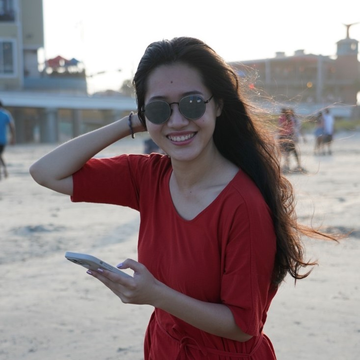

 
    

 <b>Dr. <a href="https://en.wikipedia.org/wiki/Engineer%27s_degree#Netherlands" target="_blank">ir.</a> Sui, Xinxin</b>        I am a hydroclimatologist studying coupled human–hydroclimate systems, from how urbanization and land use change reshape precipitation and runoff to how those extremes impact water resources and human activities.     <em>“Sui” is both my last name and my nickname (it's a rare surname in China) - feel free to call me Sui! </em>  

<!-- Icons Row -->

  
  
  
  

 



<a href="/news.html">Latest News: {{ latest.title }} ({{ latest.date | date: "%B %-d, %Y" }})</a>

### Education

- **Ph.D.** Civil Engineering, **UT Austin, USA**, 2025 

- **M.S.** Civil Engineering, **TU Delft, Netherlands**, 2019

- **B.E.** Environmental Engineering, **Jilin University, China**, 2017

---

### Experience 

 Sui, Xinxin is an Advanced Study Program (<a href="https://edec.ucar.edu/advanced-study-program/postdoctoral-fellowship-program" target="_blank">ASP</a>) Postdoctoral Fellow at the National Center for Atmospheric Research (NCAR), starting in 2026, and a former NASA Future Investigator in Earth and Space Science and Technology (<a href="https://science.nasa.gov/researchers/solicitations/roses-2024/amendment-63-finesst-smds-graduate-student-research-final-text-and-due-date-released/" target="_blank">FINESST</a>, 2022–2025). She received her Ph.D. in Civil and Environmental Engineering from the University of Texas at Austin, her M.S. from Delft University of Technology in the Netherlands, and her B.E. from Jilin University in China.     Her doctoral research investigates the influence of urbanization on precipitation across global (<em>PNAS</em>, 2024<a href="/publications#pub10">10</a>), national (<em>Science Advances</em>, 2025<a href="/publications#pub11">11</a>), and regional (<em>Nature</em>, 2026<a href="/publications#pub13">13</a>) scales. Using satellite-based precipitation datasets, she quantified how annual and extreme precipitation differ between more than 1,000 global cities and their rural surroundings, finding that 63% of these cities experience "urban wet islands," shaped by regional climatological and geographical conditions. This pattern motivated her to disentangle urban effects from regional climate forcings, leading her to investigate the diurnal mechanisms of urban rainfall enhancement across inland, coastal, and complex-terrain cities. Beyond this climatological analysis, she conducted a storm-event analysis, extracting over 40,000 storm events from 23 years of Texas warm seasons to examine how different storm dynamics (convective, frontal, and tropical systems) interact with urbanization. This research has received widespread attention and was featured in over 40 international media outlets, including <em>The Washington Post</em>, <em>USA Today</em>, and <em>PBS Terra</em>.     Her Master's research at TU Delft simulated rainfall-runoff processes in a semi-urbanized catchment, using the San Antonio basin as a case study. The downstream position of San Antonio City within the basin provided a unique setting to evaluate whether nature-based water management strategies, such as green roofs and permeable pavements, can reduce peak runoff or inadvertently intensify flooding at the catchment scale. Beyond scientific research, Sui has been involved in applied, real-world projects. This interdisciplinary <a href="https://www.tudelft.nl/infrastructures/onderwijs/studentenprojecten/sponge-city-china">Sponge City project</a>, supported by Arcadis and Delft University of Technology, brought together graduate students in water resources engineering, hydraulic engineering, urban planning, and architecture. As a pilot initiative for academic-industry collaboration, it fostered extensive dialogue among the university, local government, and other stakeholders.     Prior to her Ph.D. study at UT Austin, Sui worked as a research assistant at both Peking University in China and the National University of Singapore. This diverse international background, spanning academia and industry, and disciplines including hydrology, atmospheric science, remote sensing, and machine learning, equips her with a broad perspective and a strong ability to identify and address complex hydroclimate and water resources challenges.   

---

### Research Keywords

- Urban Hydroclimate

- Remote Sensing

- Hydrological Modelling

- Data-driven Approaches

---

### Contact

- Xinxin.Sui@mines.edu 

- SuiXinxin95@gmail.com  

