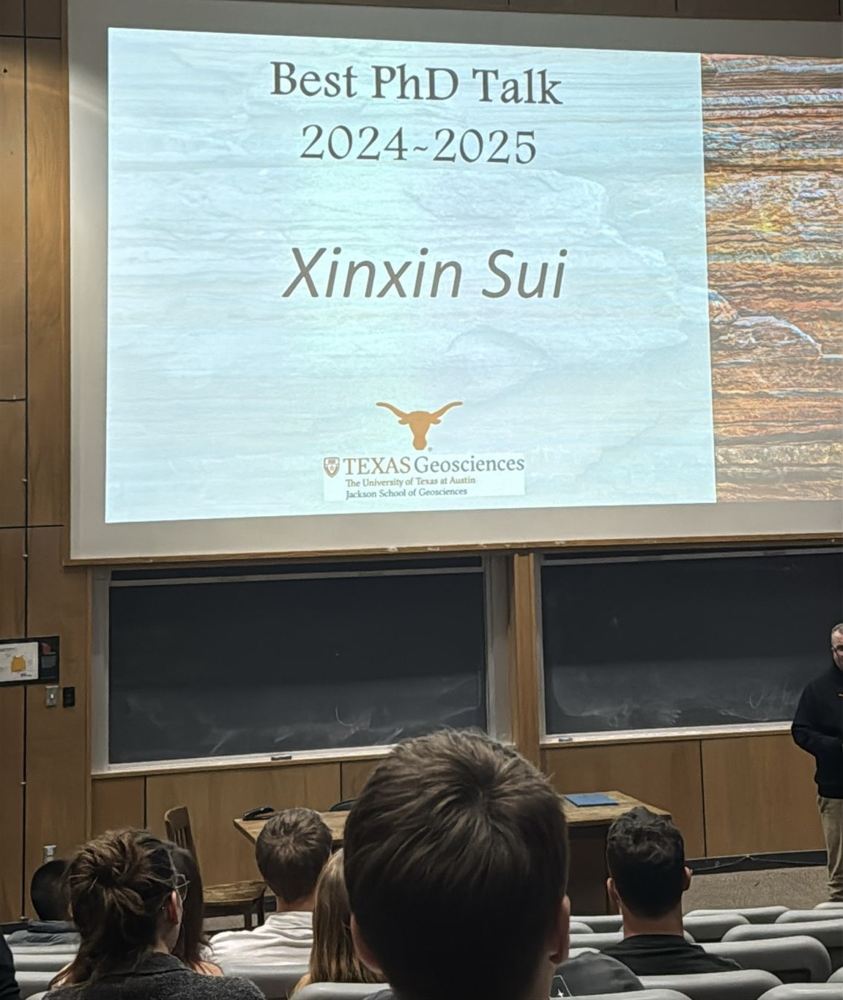
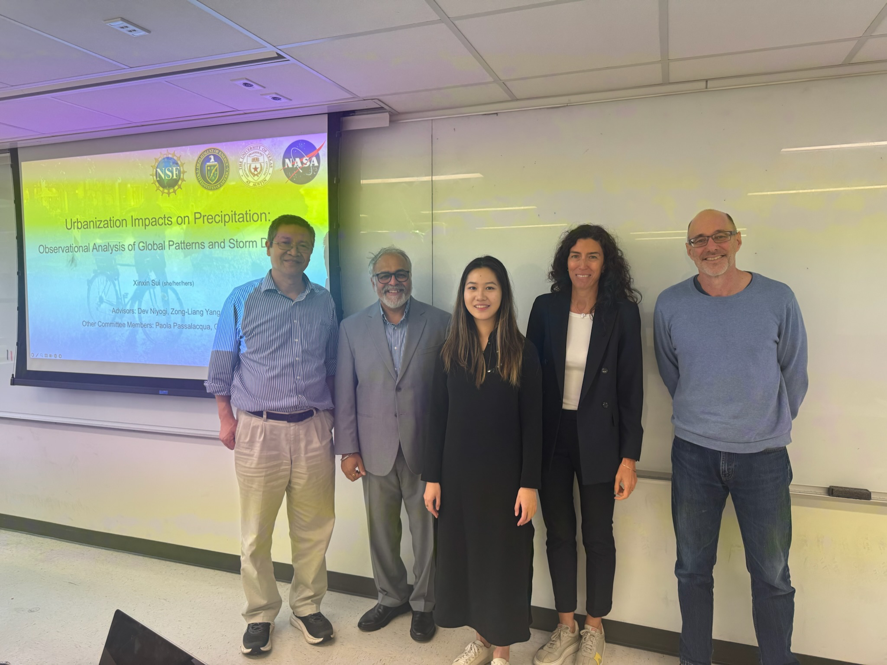
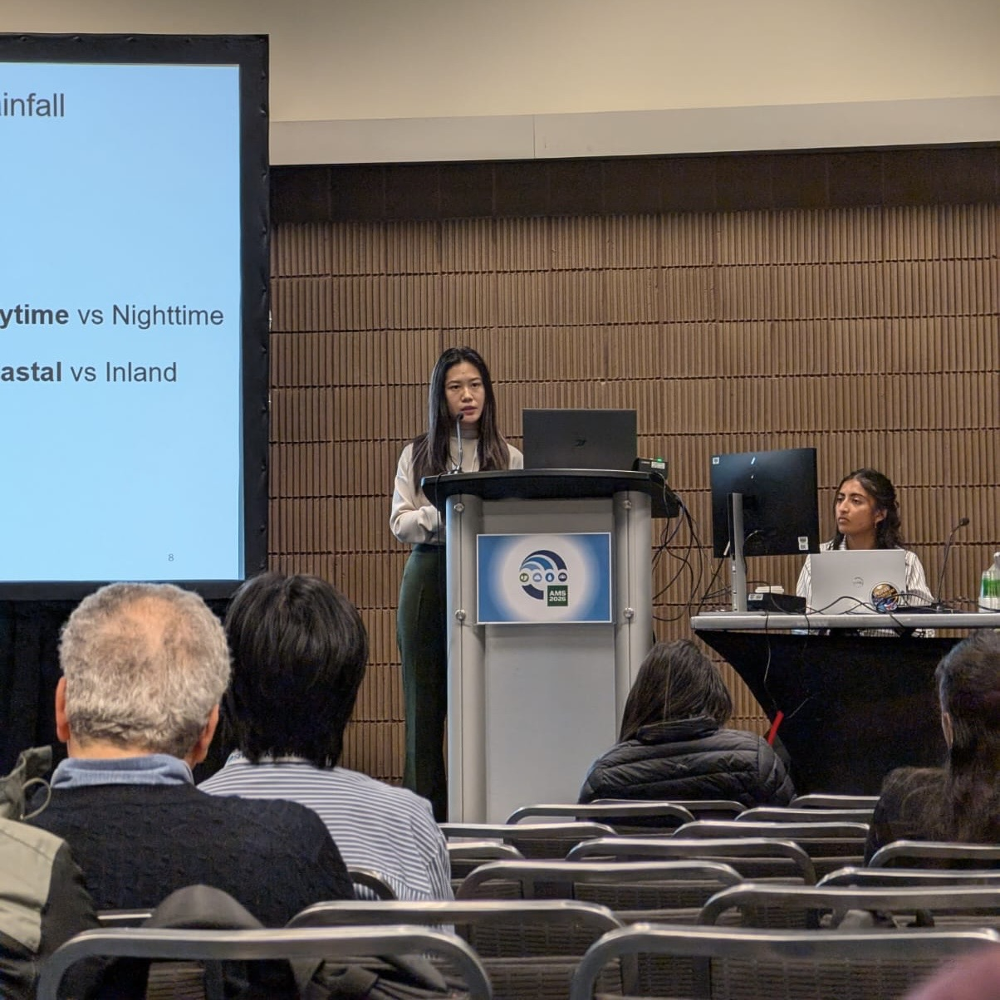
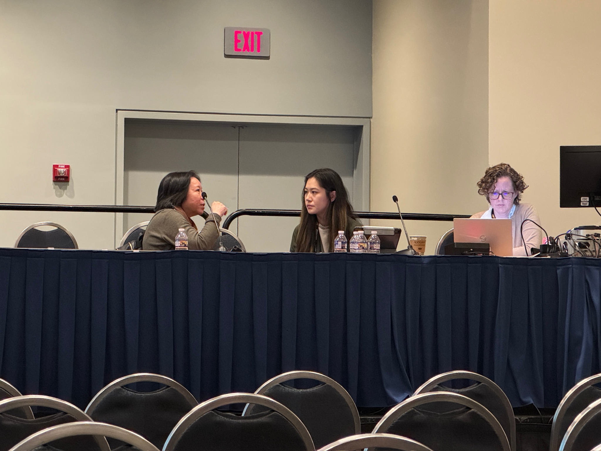

  

    
    
Best PhD Award 2024-2025

    
April 22, 2025

    
Awarded the Best PhD Talk at the Jackson School of Geosciences, UT Austin.  Thanks to Shuku for the photo!

  

  

    
    
PhD Defense Completed

    
March 28, 2025

    
Successfully defended my PhD dissertation at UT Austin.  Grateful to many people,  I would like to share the acknowledgements section of my dissertation here. <a href="/news/defense.html">Read more</a>

  

  

    
    
Presented at AMS 2025

    
January 17, 2025

    
Shared my work on urban precipitation anomalies at the AMS Annual Meeting.

  

  

    
    
Chaired an Urban Climate Session at AGU 2024

    
December 12, 2024

    
Co-chaired an urban climate session with Dr. Ruby Leung, Dr. Jessica Eisma, and and Dr. Alka Tiwari. at the AGU Fall Meeting.  (Does anyone else wonder why it’s called the “Fall” Meeting while it’s always held in mid-December?).

  

  

  
  
TV Interview with PBS Terra

  
November 14 2024

  
I’m thrilled to share that I was invited for a TV interview with PBS Terra, where I talked about how cities can shape surrounding storms and rainfall intensity. It was such an exciting experience to bring urban hydroclimate science to a wider audience! <a href="https://www.youtube.com/watch?v=RjoRttLlkW0" target="_blank">Watch video</a>

  

  

    
    
Summer Visit to Texas A&M

    
July 25, 2024

    
I really enjoyed my three-week visit with Dr. John Nielsen-Gammon’s group and the Southern Regional Climate Center at Texas A&M University. Every group member was warm， sincere, and dedicated. Thanks to Alison and BJ for introducing me to Blue Baker. I loved that brunch spot! I’m excited to continue collaborating with Dr. Nielsen-Gammon to deepen our understanding of Texas climate and water resources. Howdy! 

  

  

---
