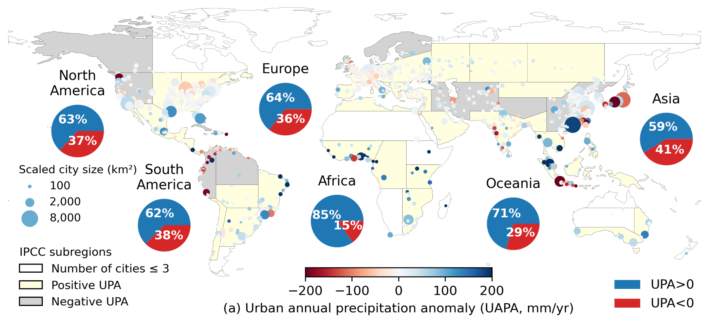
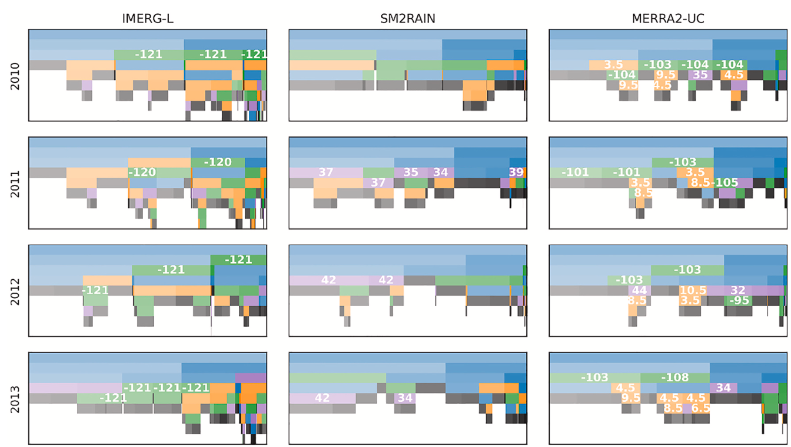
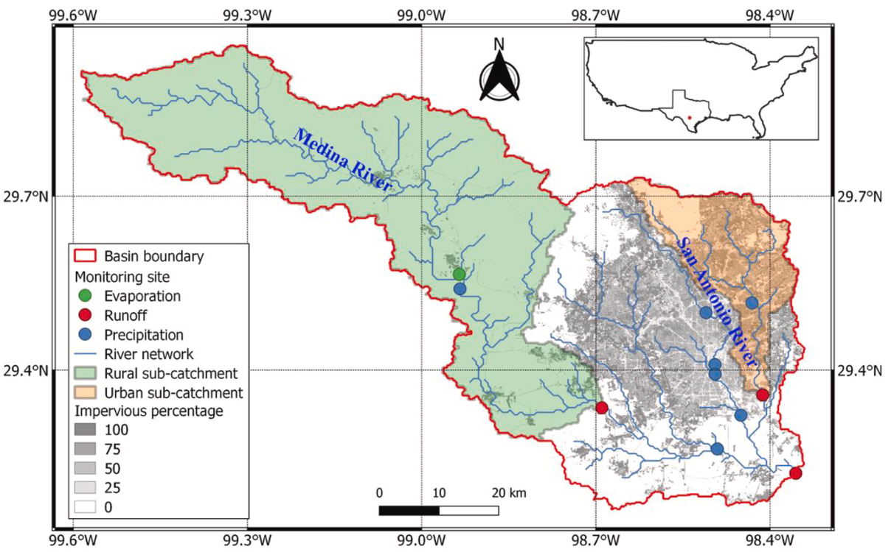

### Urbanization’s Impacts on Precipitation: Observational Analysis of Global Patterns and Storm Dynamics

 Urban heat islands are a widely known impact of urbanization on regional temperature, but does urbanization also influence rainfall? My PhD research explores this scientific question by investigating urban-rural rainfall differences across global<a href="/publications#pub10">10</a>, national<a href="/publications#pub11">11</a>, and regional<a href="/publications#pub13">13</a>scales. We began by mapping urban rainfall hotspots in over 1,000 cities worldwide, focusing on both total precipitation amount and extreme precipitation. This global analysis revealed diverse urban rainfall patterns shaped by geographic and climatic contexts.     Building on this, we conducted an hourly rainfall analysis for cities under inland, coastal, and mountainous regions where sea–land breezes and orographic effects play important roles in shaping diurnal urban-induced precipitation anomalies. Beyond long-term climatological changes, we investigated individual storms, hypothesizing that cities could influence different kinds of storms in different ways. Extracting over 40,000 storm events from 23 years of Texas warm seasons, we found diverse urban impacts on convective, frontal, and tropical systems, including more frequent local-scale convective storms and altered intensity in cold and warm frontal storms.     This work has received widespread attention and was featured in over 40 international media outlets. The findings can inform improvements in climate models and the prediction of extreme precipitation in urban areas. These insights will help cities better prepare for weather extremes and support policymakers in designing resilient cities in the future.    <em>Collaborators: Dev Niyogi (UT Austin); Zong-Liang Yang (UT Austin); John Nielsen-Gammon (Texas A&M); Marshall Shepherd (University of Georgia) </em>  

Source: Sui et al. (<em>PNAS</em>, 2024)<a href="/publications#pub10">10</a>

---

### Quantifying Uncertainty in Observational Precipitation Datasets 

 Accurate precipitation data is essential not only for scientific research, but also for real-world applications such as urban water management and flood and drought risk mitigation. This project focuses on evaluating the accuracy of satellite (top-down and bottom-up retrieval approaches) and reanalysis precipitation datasets using both statistical methods<a href="/publications#pub4">4</a> and data-driven machine learning approaches<a href="/publications#pub6">6</a>.     While previous studies have used machine learning to enhance data quality, many rely on black-box models that lack transparency. In contrast, our project applies interpretable machine learning methods to not only improve precipitation estimates but also to reveal insights about the underlying data errors and biases. This data-driven approach also helps us better understand the physical processes affecting rainfall measurements.     This work assesses the quality of precipitation datasets and identifying sources of error, which contributes to the advancement of precipitation retrieval algorithms and lead to more reliable and accurate precipitation data for both scientific and practical applications.    <em>Collaborators: Zhi Li (CU Boulder); Guoqiang Tang (Wuhan University); Zong-Liang Yang (UT Austin); Dev Niyogi (UT Austin) </em>  

Source: Sui et al. (<em>Remote Sensing of Environment</em>, 2022)<a href="/publications#pub6">6</a>

---

### Low Impact Development for Peak Runoff Reduction in Cities and Catchments

 Over 50% of the world’s population lives in urban areas, which occupy only 1%–3% of Earth’s land surface. The high population density and extensive impervious surfaces in cities amplify hydroclimate risks, particularly flooding. To mitigate these risks, civil engineers have proposed low impact development with green-blue infrastructures such as green roofs and permeable pavements that help manage stormwater. But can these strategies provide effective solutions across cities with different conditions?     In collaboration with experts in urban planning, architecture, and hydraulic engineering from TU Delft and Arcadis, we designed and simulated green-blue measures for a real-world project aimed at reducing urban runoff<a href="/publications#pub1">1</a>. My Master’s research focused on advancing this work. We developed a semi-distributed hydrological model to simulate rainfall-runoff processes in a semi-urbanized catchment.     Our results showed that impervious surfaces significantly increased peak runoff in urban areas. While green-blue infrastructure effectively reduced urban runoff and delayed peak flows, this delay may lead to larger overlap with rural runoff, which responses more slowly to rainfall. Therefore, catchment-scale conditions must be considered when designing integrated urban water management strategies. This was the first research project I led, and it resulted in my first peer-reviewed publication in the Journal of Hydrology.<a href="/publications#pub8">8</a>     <em>Collaborators: Frans Van de Ven (aQuest water, TU Delft); Arcadis; Camille Fong; Mesut Ulku, Jiechen Zheng, Thomas Dillon Peynado, Michael van der Lans </em>  

Source: Sui et al. (<em>Journal of Hydrology</em>, 2023)<a href="/publications#pub9">9</a>

---
